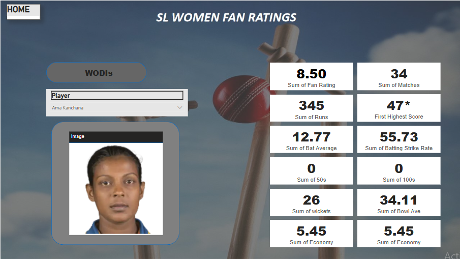

# Sri Lanka Women Cricket Team Performance Dashboard (Power BI)

## Project Overview
This Power BI dashboard provides an in-depth analysis of the Sri Lanka Women’s Cricket team’s performance in WT20Is (Women’s Twenty20 Internationals) and WODIs (Women’s One Day Internationals). The dashboard is designed to deliver actionable insights and visualize key metrics that highlight the team’s and individual players’ achievements.

## Features

### Interactive Dashboard Pages
- **Overview/Home Page:** An intuitive landing page summarizing overall team performance and key statistics.
- **WT20Is Page:** Detailed performance metrics specific to Women’s T20 International matches.
- **WODIs Page:** Comprehensive insights into Women’s One Day International matches.
- **Top Players Page:** Highlights top performers with detailed batting and bowling statistics.

### Key Performance Metrics Visualized
- **Fan Ratings:** Track popularity and fan engagement.
- **Match Statistics:** Number of matches played, total runs scored, and highest individual scores.
- **Batting Metrics:** Batting averages, strike rates, number of 50s and 100s.
- **Bowling Metrics:** Bowling averages, wickets taken, catches, and economy rates.

### Interactive Visual Elements
- Use of buttons, cards, slicers, and graphs for a dynamic user experience.
- Clear, easy-to-understand visualizations that allow users to explore data by player, match type, and time period.

## Technologies Used
- Microsoft Power BI for data visualization and dashboard creation.
- Data sourced from official cricket statistics databases.

## Skills Demonstrated
- Data Visualization
- Data Analysis
- Interactive Dashboard Design
- Sports Analytics

## How to Use
1. Download the Power BI report file (.pbix) from this repository.
2. Open the file in Power BI Desktop.
3. Explore the different pages and interact with the filters to analyze various aspects of the Sri Lanka Women’s Cricket team performance.
---

## Dashboard Preview

### Home Page

### WT20Is

### WODIs

### Top Players

---

## Hashtags

#PowerBI #DataVisualization #SportsAnalytics #Cricket #WomenInSports #SriLankaCricket #Dashboard #DataAnalysis #InteractiveDashboard #MicrosoftPowerBI
